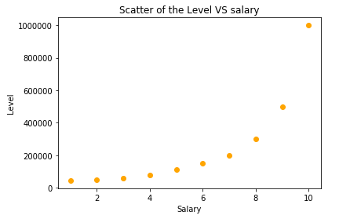
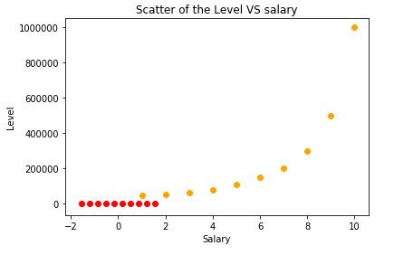
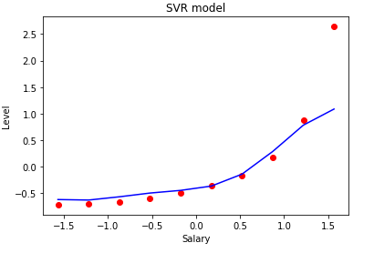

# Support-Vector-Regression

# Business problem statement
The company wants to develop an accurate compensation delivery base on the work position level.  

# Solution
Because the scatter plot of the datasets shows the non-linear relationship (As shown below), hence the model chose is the SVR machine learning model to build the non-linear regression. 

# Technical concern
1. SVR Class in the scikit-learn does not include the feature scaling procedure, hence the data need to be preprocessing before using to train the model.

2. The input for the prediction need to be scaled as well.

 ## Why scaling is important?
1. The algorithms are sensitive to the magnitude. Non scaled inputs could deviate the weights and contribute to the bad model.
2. Can faster the calculation. 

## Visualization to see the meaning of the scaling

# Result
SVR model captures the relationship between the position level and the according to salary. The model does not affect by an outlier, which is the Ceo who has a much higher income than the other C-level employees.  

Here is an interesting article on should the CEO compensation. Statistical research on the correlation between CEO income and the company stock price performance.

https://www.institutionalinvestor.com/article/b1db3jy3201d38/The-MBA-Myth-and-the-Cult-of-the-CEO

# Conclusion 
The SVR model can successfully predict the accurate salary base on the position level, and it is robust.

